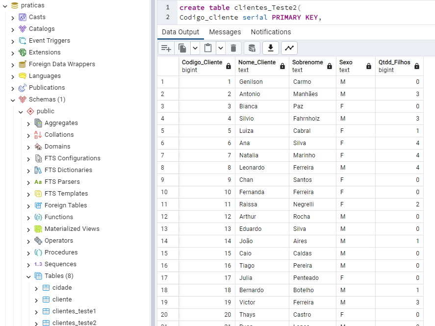
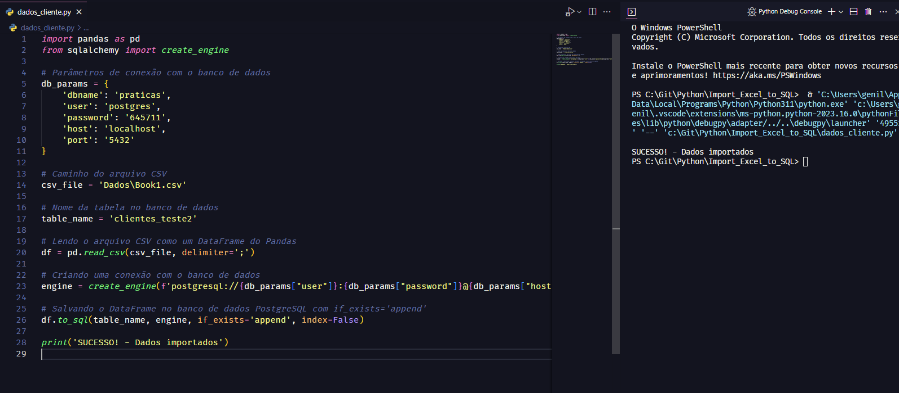

#         

###     🔵  

> **Pandas** 
>
> https://pandas.pydata.org/
>
> Pandas é derivado do termo **Pan**el **Da**ta.
>
> É uma biblioteca para Ciência de Dados de código aberto (*open source*), construída sobre a linguagem Python.
>
>  Pode ser utilizado para várias atividades e processos, entre eles: **limpeza e tratamento de dados**, **análise exploratória de dados (EDA)**, suporte em atividades de Machine Learning, consultas e queries em bancos de dados relacionais, visualização de dados, *webscraping* e muito mais. E além disso, também possui ótima integração com várias outras bibliotecas muito utilizadas em Ciência de Dados, tais como: Numpy, Scikit-Learn, Seaborn, Altair, Matplotlib, Plotly, Scipy e outros. 
>
>
> att,
>
> **♕** **Genilson do Carmo**

 🐍 - Abaixo algumas capturas de dados tanto em arquivo de **dados local** quanto acesso na **nuvem** - 🐼

 

###     🔴  

> **sqlalchemy** 
>
> https://www.sqlalchemy.org/
>
> SQLAlchemy é o kit de ferramentas Python SQL e mapeador relacional de objetos que oferece aos desenvolvedores de aplicativos todo o poder e flexibilidade do SQL.
>
> Ele fornece um conjunto completo de padrões de persistência de nível empresarial bem conhecidos, projetados para acesso eficiente e de alto desempenho ao banco de dados, adaptados em uma linguagem de domínio simples e Pythonic. 
>
>
> att,
>
> **♕** **Genilson do Carmo**

 🐍 - Abaixo algumas capturas de dados em arquivo de **dados local** - 🗺️

 

 

              
