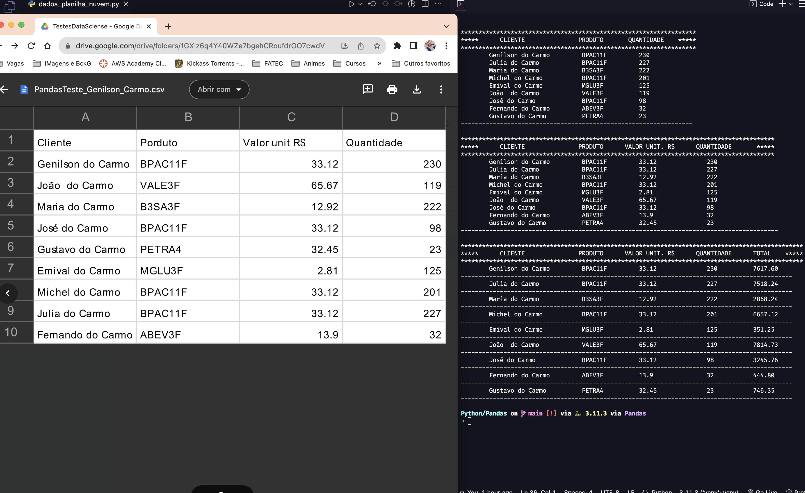

####         

###     🐍  

>  **Python** é uma linguagem de programação altamente versátil, com uma comunidade ativa, **ampla demanda no mercado** de trabalho e um futuro brilhante. Sua facilidade de uso e ampla aplicação a tornam uma escolha sólida para desenvolvedores e empresas em todo o mundo.  
>
>
> att,
>
> **♕** **Genilson do Carmo**

####  

🟡 Abaixo algumas capturas de tela de aplicações, apps, serviços etc.

​	🔎 Acesse o diretório correspondente para mais detalhes.
​			🐼 -  [PANDAS](https://github.com/GenilsonDC/Python/tree/main/Pandas)  

	🐼 - PANDAS  https://github.com/GenilsonDC/Python/tree/main/Pandas

 

 

 

              
