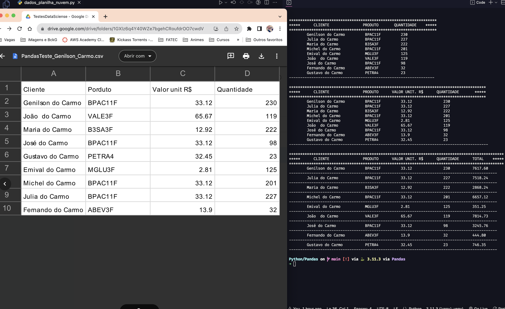

#   

#         

###     ⚫️  

> ## **Pandas** 
>
> https://pandas.pydata.org/
>
> Pandas é derivado do termo **Pan**el **Da**ta.
>
> É uma biblioteca para Ciência de Dados de código aberto (*open source*), construída sobre a linguagem Python.
>
>  Pode ser utilizado para várias atividades e processos, entre eles: **limpeza e tratamento de dados**, **análise exploratória de dados (EDA)**, suporte em atividades de Machine Learning, consultas e queries em bancos de dados relacionais, visualização de dados, *webscraping* e muito mais. E além disso, também possui ótima integração com várias outras bibliotecas muito utilizadas em Ciência de Dados, tais como: Numpy, Scikit-Learn, Seaborn, Altair, Matplotlib, Plotly, Scipy e outros. 
>
>
> att,
>
> ## **♕** **Genilson do Carmo**

 🐍 - Abaixo algumas capturas de dados tanto em arquivo de **dados local** quanto acesso na **nuvem** - 🐼

 

###     ⚪️  

> ## xmltodict
>
> https://pypi.org/project/xmltodict/
>
> `xmltodict`é um módulo Python que faz com que trabalhar com XML pareça que você está trabalhando com [JSON](http://docs.python.org/library/json.html) , como nesta ["especificação"](http://www.xml.com/pub/a/2006/05/31/converting-between-xml-and-json.html).
>
> ## Suporte a namespace
>
> Por padrão, `xmltodict`não faz nenhum processamento de namespace XML (ele apenas trata as declarações de namespace como atributos de nó regulares), mas a passagem `process_namespaces=True`fará com que ele expanda os namespaces
>
>
> att,
>
> ## **♕** **Genilson do Carmo**

 

 

              
